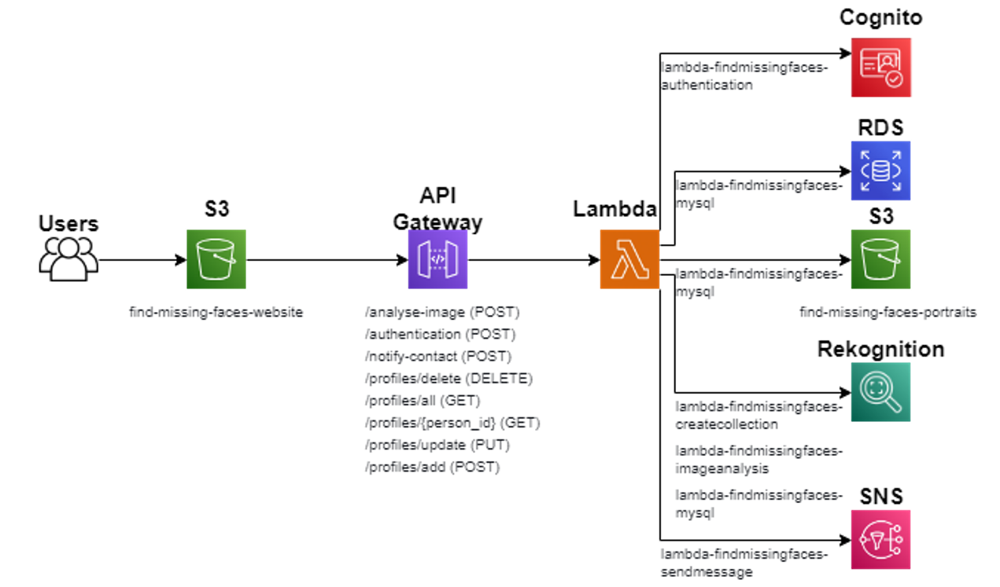

# Find Missing Faces - Facial Recognition Website Built With AWS 
## A website where users can upload portraits and profiles of missing persons which will be compared with faces detected in images uploaded to the website to potentially locate them. 
Website video demonstration [here](https://youtu.be/Cupo4evGELk)
#### Created for Cloud Technologies for AI module using AWS Learner Lab account

# Table of Contents 
- [Details](#details)
- [Features](#features)
- [Tools Used](#tools-used)
- [AWS Services Used](#aws-services-used)
- [Image Sources](#image-sources)

## Details 
An overview and documentation of this project can be viewed in [Report](Documentation/Report.docx) for details on how the project was set up. 

The general structure of the website with regards to AWS service interactions is as shown, with elaborations included in the Report:

## Features
1. Authentication
  - Register
    - Receive email and password credentials to register a new user.  
  - Login
    - Receive email and password credentials to log a user in. 
  - Confirm Email 
    - Send a confirmation code to registering users, or users logging in who had not confirmed their email during registration.
  [Authentication Video Demo](https://github.com/celestina21/Find-Missing-Faces-/blob/main/Documentation/Authentication%20Demo.mp4)
2. Database-Related
  - View all Profiles (Search page)
    - All profiles are shown in a search page if no search queries are entered, with just their portrait, name, last location (if any) and close contact shown in a preview.
  - View Specific Profile
    - A profile's full details (portrait, name, last location, date when they were last seen, description, contact) is shown when clicked into from the Search page. 
  - Add Profile (Add Missing Person page)
    - Add a missing person's details and portrait to the website for them to potentially be identified in scene images submitted by other users in future.
    - A unique key will be shown to user one time for them to use for verification purposes in Update and Delete operations. 
  - Update Profile
    - Requires verification with unique key.
    - After verification, user can update any details in the profile.
    - If image is updated, the new image will be indexed and stored in the website's rekognition collection while the indexed old image is deleted. Old portrait is also deleted from S3.
    - If contact is updated, the subscribed phone number to the SNS topic of this profile will be updated.
  - Delete Profile
    - Requires verification with unique key.
    - After verification, profile is deleted from database and website, indexed portrait is deleted from the website's Rekognition collection, and the SNS topic is deleted.
3. Image analysis 
  - Portraits submitted with profiles of missing people will be indexed and stored in a rekognition collection to facilitate facial comparison.
  - Faces in a scene image will be detected and each face compared with missing people's (indexed) faces in the aforementioned collection for any matches.
  - Results displayed will include previews of profiles of top 3 matches and bounding boxes around the faces in the scene image that seemingly match the portraits of these profiles.
4. Additional
  - Users who submitted a scene image with matches can choose to notify any of the matches' close contacts with details of the image such as location and date. Close contacts are notified via SMS.
  
  - Users can search profiles by name in the Search page.

## Tools Used 
- JavaScript (Client-side scripting)
- MySQL (Database)
- Python (Botocore, Server-side scripting)

## AWS Services Used
- AWS Lambda (Server-side scripting)
- Amazon API Gateway (HTTP APIs to trigger Lambda functions)
- Amazon RDS (Database Creation & Management)
- Amazon S3 (Static website hosting, portrait storage)
- Amazon Rekognition (Image analysis)
- Amazon SNS (Notifications)
- Amazon Cognito (Authentication)

## Image Sources 
Website icon retrieved from Flaticon, by [alkhalifi design](https://www.flaticon.com/authors/alkhalifi-design)

The banner image retrieved from Shutterstock, by [Ksenia Shestakova](https://www.shutterstock.com/image-photo/man-dad-having-quality-time-their-2189267477)
